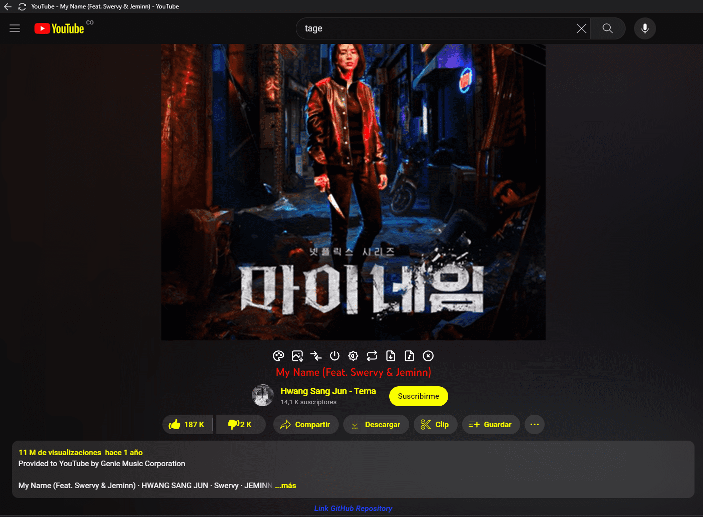

# Youtube-tools-extension

   
  

[GreasyFork](https://greasyfork.org/es/scripts/460680-youtube-tools-all-in-one-local-download-mp3-mp4-higt-quality-return-dislikes-and-more)

### añade opciones extras a la pagina de youtube script o extención
Script para youtube active dark theme

Auto saltar publicidad

Auto repetir video / auto repeat video
Ver dislikes en historias

Descargar MP3 / Download MP3

Descargar MP4 Hasta 8k / up High cuality

ver dislikes en videos / return dislikes

Rating del video

Cambiar colores / change text color

Descargar miniatura.

Traducir comentarios a idioma nativo / Translate 

Filtro de pantalla / Screen 

Invertir las columnas

Adaptar color de fondo segun video

Reiniciar ajustes

ver dislikes en las historias

